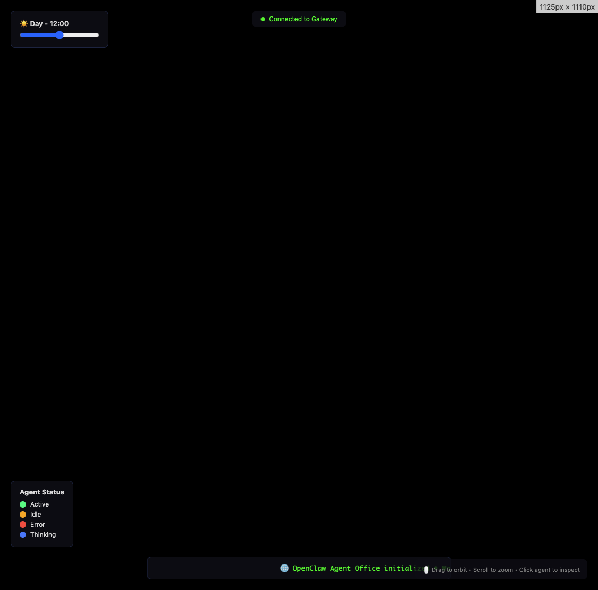

# 🏢 OpenClaw Isometric Agent Office

A premium interactive 3D isometric office visualization for OpenClaw agents, built with Three.js. All objects are modeled programmatically - no external assets required.



## ✨ Features

### Core Features
- **Full 3D Isometric Office** — Desks, chairs, monitors, keyboards, mice, plants, coffee mugs, lamps, windows, floor tiles, walls — all built from Three.js primitives
- **Agent Avatars** — Simple but expressive humanoid figures with color-coded status rings:
  - 🟢 **Green** = Active
  - 🟡 **Yellow** = Idle
  - 🔴 **Red** = Error
  - 🔵 **Blue** = Thinking
- **OrbitControls** — Smooth pan, zoom, and rotate (locked to isometric-friendly angles)
- **Ambient Animations**:
  - Monitor screen flicker
  - Gentle plant sway
  - Desk lamp glow pulse
  - Floating dust particles
  - Server rack blinking lights
- **Agent Info Panel** — Click any agent to see details: name, status, model, tokens, current task
- **OpenClaw Gateway Integration** — Polls the agent-monitor dashboard API for real-time agent data

### Bonus Features
1. **Day/Night Cycle** — Time slider adjusts lighting from warm morning to cool midday to dark night
2. **Activity Feed Ticker** — LED-style scrolling marquee showing recent agent activity

## 🚀 Quick Start

### Option 1: Open Directly
```bash
open /Users/duckets/.openclaw/workspace/agent-isometric-office/office.html
```

### Option 2: Serve Locally
```bash
cd /Users/duckets/.openclaw/workspace/agent-isometric-office
python3 -m http.server 8080
# Then open http://localhost:8080/office.html
```

### Option 3: Use with OpenClaw Dashboard
The visualization connects to the agent-monitor dashboard API at:
- `http://localhost:3001/api/gateway`

Make sure the dashboard is running:
```bash
cd /Users/duckets/.openclaw/workspace/agent-monitor
PORT=3001 HOSTNAME=0.0.0.0 node .next/standalone/server.js
```

## 🎮 Controls

| Control | Action |
|---------|--------|
| **Left Click + Drag** | Rotate camera |
| **Right Click + Drag** | Pan camera |
| **Scroll** | Zoom in/out |
| **Click Agent** | Show info panel |
| **Time Slider** | Adjust day/night cycle |

## 🏗️ Architecture

```
agent-isometric-office/
├── office.html          # Single-file Three.js application
├── README.md            # This file
└── preview.png          # Screenshot (TODO)
```

### Technical Details

- **Three.js r128** via CDN
- **OrbitControls** for camera manipulation
- **Orthographic Camera** for true isometric projection
- **60fps target** with optimized animation loop
- **Responsive** — Fills viewport and handles window resize

### Office Layout

The office contains:
- **6 Agent Workstations** — Standard desks with monitors, keyboards, mice, coffee mugs, lamps, and optional plants
- **Boss Office** — Large executive desk with dual monitors
- **Meeting Room** — Conference table with chairs
- **Lounge Area** — Sofa, coffee table, and large plant
- **Server Rack** — With animated blinking lights

### Gateway API Integration

The visualization polls:
```
GET http://localhost:3001/api/gateway
```

Expected response format:
```json
{
  "sessions": [
    {
      "name": "DuckBot",
      "behavior": "tool_use",
      "statusSummary": "Processing messages",
      "model": "bailian/qwen3.5-plus",
      "tokens": 12345,
      "lastActivity": "2026-03-20T22:00:00Z"
    }
  ]
}
```

## 🎨 Customization

### Adding More Agents
Edit `CONFIG.agentCount` in the JavaScript:
```javascript
const CONFIG = {
  agentCount: 8, // Increase from 6
  // ...
};
```

### Changing Colors
Modify `STATUS_COLORS`:
```javascript
const STATUS_COLORS = {
  active: 0x00ff88,   // Green
  idle: 0xffaa00,     // Yellow
  error: 0xff4444,    // Red
  thinking: 0x4488ff, // Blue
};
```

### Adjusting Time Speed
The day/night cycle is controlled by the slider. For automatic cycling:
```javascript
// In animate() function:
timeOfDay = (timeOfDay + 0.01) % 24;
```

## 📊 Performance

- **Target**: 60fps on modern hardware
- **Particles**: 200 dust particles
- **Shadow Map**: 2048x2048 PCF soft shadows
- **Polygon Count**: ~5000 triangles

## 🔧 Troubleshooting

### Black Screen
- Ensure WebGL is enabled in your browser
- Check browser console for errors

### Gateway Connection Failed
- Verify dashboard is running on port 3001
- Check CORS settings if serving from different origin

### Agents Not Updating
- Check gateway API response in browser dev tools
- Verify session data format matches expected structure

## 📝 Future Enhancements

- [ ] Add click-to-zoom on agent desks
- [ ] Implement heat map overlay for activity intensity
- [ ] Add sound design (ambient office soundscape)
- [ ] Create mini-map for large office layouts
- [ ] Add time-lapse history playback
- [ ] WebSocket real-time updates instead of polling

## 📄 License

MIT License — Part of the OpenClaw project.

---

Built with 🦆 by DuckBot for OpenClaw Agent Visualization.